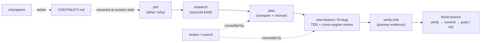
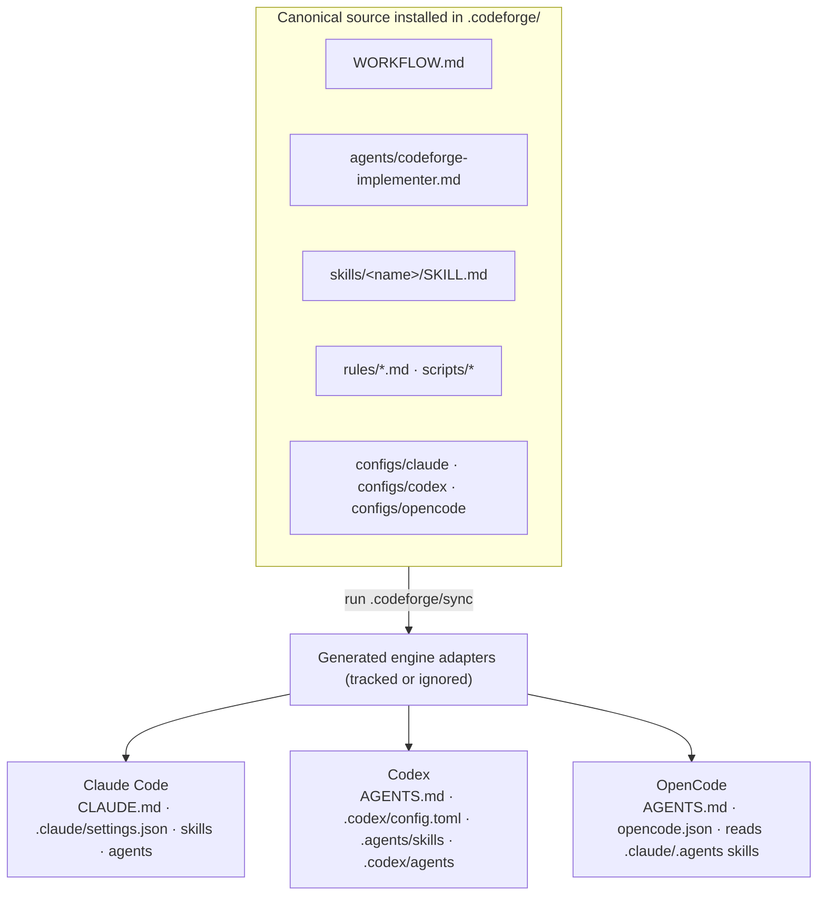

# codeforge

**One AI-coding workflow discipline that runs identically on Claude Code, Codex, and OpenCode.**

codeforge installs a consistent, opinionated way of working into your project — **research →
plan → TDD → cross-engine review → verify → ship** — plus shared memory and session
continuity. Point any of the three CLIs at the project and they pick up the **same** rules,
skills, and guardrails. No per-engine fork to maintain, no echo chamber: the reviewer always
runs on a *different* engine than the driver.

It's **skills + config first** — no runtime hooks by default, no daemon, nothing to keep
running. The install writes Markdown, config, and bounded helper scripts into your repo. Generated engine adapters
can be committed for zero-step clones or ignored and rebuilt locally from `.codeforge/`.

```bash
cd /path/to/your-project
npx @jualopezmo/codeforge      # opens an interactive setup wizard
```

---

## Quick start

**1. Install into your project.** In a terminal, this opens a full-screen setup wizard:

```bash
cd /path/to/your-project
npx @jualopezmo/codeforge
```

The wizard (available in **English / Español**) detects which engines you have (you don't need
all three), lets you pick your **default reviewers and council advisors**, a **gate profile**,
project options, and whether generated adapters belong in Git, then runs the installer. Prefer
no UI? Pass any flag (or run in CI / a
pipe) and it installs non-interactively — the wizard even prints the exact non-interactive
command it would run.

**2. Open the project in any engine.** `CLAUDE.md` / `AGENTS.md` and the skills load
automatically. The agent reads `CONTINUITY.md` and resumes from its **Next step**.

**3. Describe your task.** The engine matches it to the right skill and walks the workflow:

> *"add a feature that lets users export their data as CSV"* → runs `new-feature`
> *"there's a bug where the total is off by one cent"* → runs `fix-bug`
> *"checkpoint before I stop"* → writes a clean handoff to `CONTINUITY.md`

That's it. The rest of this README explains the **workflow**, **how it works** under the hood,
and the full **install** reference.

---

## The workflow

Every task flows through the same disciplined path. Skills load **on demand** — you don't
memorize commands, you describe the task and the engine picks the skill.



1. **Understand** — `prd` captures problem / users / goals; `research` checks current docs and
   prior art and writes a sourced brief.
2. **Plan** — `plan` clarifies intent, compares approaches, and produces a plan that gets a
   **cross-engine review** before any code is written.
3. **Build** — `new-feature` or `fix-bug` drives **TDD** (red → green → refactor) with a
   second review pass on the diff. `quick-fix` handles trivial changes and escalates if scope
   grows.
4. **Verify** — `verify-e2e` runs real user-journey use cases and writes an **evidence report**
   that the ship-gate is bound to (you can't check the box without the report).
5. **Ship** — `finish-branch` confirms the gates are green, runs a final verify, commits, and
   pushes / opens a PR — pausing for your approval at the outward action.
6. **Continue** — `checkpoint` writes a concrete handoff to `CONTINUITY.md` so the next session
   (same engine or a different one) picks up exactly where you left off.

### All skills

| Skill | Purpose |
| --- | --- |
| `prd` | Capture problem / users / goals before designing → `docs/prds/` |
| `research` | Check current docs + prior art, write a sourced brief → `docs/research/` |
| `plan` | Clarify intent, compare approaches, write a reviewed plan → `docs/plans/` |
| `new-feature` | Full feature flow: research → plan → review → TDD → review → verify → ship |
| `fix-bug` | Systematic debugging: reproduce → root cause → failing test → fix → ship |
| `quick-fix` | Trivial changes (<3 files); escalates if scope grows |
| `review` | Cross-engine second opinion on a plan or diff (P0–P3 findings) |
| `simplify` | Post-green, behavior-preserving cleanup pass (tests stay green) |
| `verify-e2e` | Run API/CLI/UI user-journey use cases, write an evidence report, bind the E2E ship-gate to it |
| `council` | Multi-engine advisors → verdict + minority report (hard, expensive forks) |
| `adr` | Record an architecture decision (context, alternatives, consequences) → `docs/adr/` |
| `finish-branch` | Confirm gates → final verify → commit → push → PR |
| `checkpoint` | Write a clean session handoff to `CONTINUITY.md` before closing |
| `index` | Generate/refresh `docs/index.md` — a high-level project map for fast orientation |

**Triggering a skill** (same across all three engines):

- **Implicitly** — just describe the task; the engine matches it to a skill's `description`.
- **Explicitly** — name it: *"use the `new-feature` skill"*, *"run `council` on A vs B"*.
- **Not sure what's available?** Ask *"what skills do you have in this project?"*

---

## How it works

### One neutral source, generated per engine (no symlinks)

Each installed project carries **one local source of truth** in `.codeforge/`: instructions,
agent contracts, skills, rules, scripts, per-engine configs, docs, templates, and the sync tools. The installer
assembles it from the npm payload and generates each engine's discovery files **by plain copy**
— no symlinks, so it behaves identically on macOS, Linux, and Windows.



- **`.codeforge/WORKFLOW.md`** is the canonical methodology. Root `CLAUDE.md` uses Claude's
  native imports to load it alongside `PROJECT.md`; `AGENTS.md` gives Codex/OpenCode the same
  two-file bootstrap without duplicating their contents.
- **Skills** live once in `skills/` and are copied into the two paths that cover all three
  engines: `.claude/skills` (Claude Code, also read by OpenCode) and `.agents/skills` (Codex,
  also read by OpenCode).
- **Implementation agents** live as an engine-neutral contract under `.codeforge/agents/`.
  Sync renders the Claude Code Markdown and Codex TOML adapters without pinning a model, so
  each inherits the active engine defaults.
- **Configs** (`.claude/settings.json`, `.codex/config.toml`, `opencode.json`) are generated
  from project-owned canonical inputs under `.codeforge/configs/`. The installer seeds missing
  entries but preserves local edits and additions on reinstall/upgrade. Per-project Claude overrides go in the gitignored
  `.claude/settings.local.json`.
- Generated engine adapters can be **committed** so a fresh clone works immediately (the
  default), or **gitignored** and rebuilt after cloning. In either mode, customize `.codeforge/`
  and run `.codeforge/sync.sh` (or `pwsh .codeforge/sync.ps1`).

> **Why copies, not symlinks?** Symlinks are fragile on Windows and across zip/clone mirrors.
> One source + a generator gives a single place to edit without ever fighting symlink support.
> For safety, installation and sync fail before mutation when a codeforge-managed directory is a
> symlink or Windows reparse point; generated leaf files are replaced atomically.

### Self-contained install

The complete operational harness lands under `.codeforge/`; only framework-development tools
such as the wizard source, linter, evals, and installers stay in the npm package/repository.
This makes the boundary obvious: edit `.codeforge/`, regenerate the engine adapters, and commit
the canonical source plus either the adapters or the selected ignore policy. No global
installation or codeforge checkout is needed after setup.

### Enforcement model — honest about what each signal is worth

This is **discipline, not a magic hard gate.** codeforge is precise about how much each signal
is worth (see [`ship-gates.md`](src/codeforge/rules/ship-gates.md)):

- **Advisory** — the skills *instruct* the agent to pass the gates before shipping.
- **Attested** — `finish-branch` runs `.codeforge/scripts/check-gates.sh` (`.ps1` on Windows), a
  deterministic check that reads `.codeforge/workflow/state.md` and **exits non-zero** listing any
  unchecked box. It validates the *record* (a checked box is a claim), it's **local**, and it
  only runs when invoked.
- **Verified** — the only signal independent of the agent: a shipped **Verified-tier CI
  template** (`docs/ci-templates/gates.yml`) has CI independently re-run your project's
  declared test command on the PR's merge result, outside any agent's turn. Copy it into
  `.github/workflows/`, fill in the test step, and make it a **required status check** under
  branch protection — that's the real gate. It becomes bad-faith-**resistant** (never "proof")
  — and can bind for every clone and every merge — only once the repo is fully configured per
  [`docs/ci-templates/README.md`](src/docs/ci-templates/README.md): CODEOWNERS on the workflow
  file and the test-defining files, "Dismiss stale pull request approvals", strict/up-to-date
  checks or a merge queue, and no bypass for admins — and even then it still depends on a human
  actually reading those diffs. Repo/org admins can still bypass branch protection unless
  you've configured otherwise.

On top of that, each engine shows a **best-effort native prompt** on outward actions — it
matches by command pattern and reads no gate state, so it's a commit-confirmation, not proof
the gates are green:

| Engine | Native prompt | Config |
| --- | --- | --- |
| Claude Code | `git push` / `gh pr create` are `ask`-tier | `.claude/settings.json` |
| Codex | `approval_policy` asks when a command crosses the sandbox boundary | `.codex/config.toml` |
| OpenCode | `git push*` / `gh pr create*` set to `ask` (force-push `deny`) | `opencode.json` |

**No per-engine runtime hooks.** Local discipline is advisory + `finish-branch`'s
`check-gates` (Attested); the shipped Verified-tier CI template
(`docs/ci-templates/`), made a required check via branch protection and fully configured per
its README, is what can bind for everyone.

### Memory & continuity

- **Portable memory (repo-first):** durable knowledge lives in the repo — solved bugs in
  `docs/solutions/`, decisions in `docs/adr/`, history in `docs/CHANGELOG.md` — because all
  three engines read it.
- **Continuity:** `CONTINUITY.md` holds the current focus, the single **Next step**, and
  blockers. The first golden rule tells the agent to read it at session start, so a new session
  or a reset context resumes correctly.

### Models (cross-engine roles)

The reviewer always runs on a **different configured engine than the driver** — model diversity
is the point, but the wizard's reviewer/advisor selection is an authoritative allowlist. A failed
Claude review never silently enables OpenCode. The concrete model IDs, effort, bounded invocation,
and retry rules live in `.codeforge/rules/models.md`. A cross-platform runner owns the real
10-minute (600-second) timeout, terminates stalled reviewer processes, and captures stdout/stderr without
shell-interpolating the prompt; `council` uses only configured advisors.

### Execution mode (Claude Code + Codex)

During setup you can choose how the build phase runs: **inline** (the main session does the
work) or **subagent-driven** (one fresh native implementer per bounded plan task). The choice
is wired into `new-feature`/`fix-bug` via `.codeforge/rules/execution.md` and recorded in
`PROJECT.md`. The canonical `.codeforge/agents/codeforge-implementer.md` contract generates
`.claude/agents/codeforge-implementer.md` and `.codex/agents/codeforge-implementer.toml`;
OpenCode follows the explicit inline fallback until a tested native adapter is added. The wizard
only offers this choice when Claude Code or Codex is detected. Implementers run sequentially in a
shared working tree, leave changes unstaged/uncommitted, and let the parent own validation, the git
index, and the ship commit; parallel writes require isolated worktrees.

### Repo layout

The package payload lives in `src/`, keeping the repository root free of files that would
collide while developing codeforge. Installation assembles that payload into one canonical
`.codeforge/` tree in the target:

```
my-project/
├── .codeforge/                    # canonical installed source
│   ├── WORKFLOW.md
│   ├── agents/codeforge-implementer.md
│   ├── skills/<name>/SKILL.md
│   ├── rules/*.md
│   ├── scripts/*.{sh,ps1}
│   ├── configs/{claude,codex}/ · configs/opencode.json
│   ├── docs/ · templates/
│   ├── sync.sh · sync.ps1
│   ├── state.template.md
│   └── manifest · version
├── CLAUDE.md · AGENTS.md          # minimal generated entrypoints
├── .claude/ · .agents/ · .codex/  # generated engine adapters
├── opencode.json                  # generated OpenCode adapter
├── PROJECT.md · CONTINUITY.md     # project-owned
└── docs/                          # active project knowledge
```

The canonical source, root entrypoints, `PROJECT.md`, `CONTINUITY.md`, and `docs/` always remain
trackable. Local state (`.codeforge/workflow/`, `.claude/settings.local.json`) is always ignored;
the wizard lets each project commit or ignore the generated files inside `.claude/`, `.agents/`,
`.codex/`, plus `opencode.json`. Unrelated custom engine files remain trackable.

---

## Installation

codeforge is the **framework** — you install its discipline into a **target project**. With no
target argument, the installer uses the current directory.

### Fastest — `npx` (no clone)

```bash
cd /path/to/your-project
npx @jualopezmo/codeforge              # interactive wizard (or non-interactive with any flag)
npx @jualopezmo/codeforge --yes        # install with defaults, no wizard
npx @jualopezmo/codeforge --yes --ignore-generated  # rebuild adapters locally; don't commit them
npx @jualopezmo/codeforge --upgrade    # refresh framework files later
npx @jualopezmo/codeforge --version    # print the installed codeforge version
```

The Node wrapper runs the platform installer bundled in the package (`bash` / `pwsh`). The
installed harness contains Markdown, configuration, and helper scripts. **Node.js 20+ is required
for cross-engine review and council execution** through `.codeforge/scripts/run-reviewer.mjs`;
direct installation and the rest of the workflow remain usable without Node, and the installer
prints a clear warning. The selected external CLI must also be authenticated; for Claude, verify
with `claude auth status` or sign in with `claude auth login`. The runner checks this before
transmitting a complete prompt. Each install stamps `.codeforge/version` into the target, and a later
`--upgrade` from a different version prints a drift advisory.

### Interactive setup (default on a TTY)

Run with no arguments in a terminal and codeforge opens a full-screen setup console. Screens, in
order: **splash + language picker (EN/ES)** → **review policy** (default reviewers + council
advisors) → **gate profile** → **project options** → **generated-adapter policy** → optional
**execution mode** (shown when native Claude Code / Codex subagents are available) → **summary**.
The summary prints the equivalent non-interactive command using `.` as the target; run it from
the target directory shown immediately above it. This avoids shell-specific quoting failures for
absolute paths containing spaces or metacharacters.

Pass any flag, or run without a TTY (e.g. in CI or through a pipe), to skip the UI entirely.

### From a clone

```bash
# macOS / Linux
cd /path/to/your-project && /path/to/codeforge/install.sh   # install into the current dir
./install.sh /path/to/your-project                         # or name the target explicitly
./install.sh /path/to/your-project --upgrade               # refresh framework files later
```

```powershell
# Windows (PowerShell 7 / pwsh)
pwsh /path/to/codeforge/install.ps1                          # install into the current dir
pwsh ./install.ps1 C:\path\to\your-project                  # or name the target explicitly
pwsh ./install.ps1 C:\path\to\your-project -Upgrade         # refresh framework files later
```

### What the installer does

- **Builds the canonical `.codeforge/` source** with instructions, agent contracts, skills, rules, scripts,
  configs, documentation, templates, sync tools, state template, manifest, and version.
  Framework-managed content is refreshed on upgrade; custom skills and rules with distinct names
  in `.codeforge/skills/` and `.codeforge/rules/` are preserved. `.codeforge/configs/` becomes
  project-owned after seeding, so engine configuration edits and additions survive upgrades.
- **Creates project-owned files only if missing** (never clobbered on re-run): `PROJECT.md`,
  `CONTINUITY.md`, a seed `docs/CHANGELOG.md`.
- **Adopts existing agent context:** a non-codeforge `CLAUDE.md` and/or `AGENTS.md` is copied
  verbatim into an `Imported agent context` section in `PROJECT.md`, with originals retained
  under `.codeforge/backups/`. Re-installs do not duplicate the imported content.
- **Generates the engine artifacts** from `.codeforge/` (no symlinks):
  minimal `CLAUDE.md`/`AGENTS.md` entrypoints, `opencode.json`, and `.claude/`, `.agents/`,
  `.codex/`, including native Claude Code and Codex implementers. Root
  `CLAUDE.md`/`AGENTS.md` remain trackable as stable project entrypoints.
- **Asks whether generated adapters belong in Git.** `--track-generated` keeps them versioned
  (default); `--ignore-generated` ignores only the managed settings, skill mirrors, native
  implementer definitions, and `opencode.json`. Unrelated custom agents/configuration under the
  engine directories remain trackable. The choice is stored in `.codeforge/manifest`, so a later
  bare install or upgrade preserves it. If a project switches to ignored mode after those files
  were already added to Git, the installer leaves the index untouched and prints an explicit
  `git rm --cached` command that removes only the generated adapters from version control without
  deleting their local copies.
- **Creates and merges `.gitignore`** even when Git has not been initialized. User rules outside
  the delimited codeforge block are preserved; `.codeforge/`, project context, and `docs/` are
  never ignored by codeforge. An existing malformed managed block is rejected in preflight before
  any project file is changed.
- **Runs a post-install validation** that exits non-zero if any skill-discovery path, `AGENTS.md`,
  or engine config is missing, warns if a config lacks the push/PR gate, and reports when
  Node.js 20+ is unavailable for cross-engine review/council.
- **Checks for git.** The workflow and gates operate on git; if the target isn't a repo the
  installer **warns** (it never touches your VCS on its own). Pass `--git-init` to have it run
  `git init` + a baseline commit.
- **Auto-isolates Claude Code** from ancestor instructions. Codex and OpenCode scope to the
  project root, but Claude Code walks to the filesystem root and blends every ancestor
  `CLAUDE.md` into your project. So the installer writes `claudeMdExcludes` into the gitignored
  `.claude/settings.local.json` to block those ancestors — making the project run its **own**
  discipline consistently across all three engines. Pass `--no-isolate` to keep inheritance
  (e.g. an intentional monorepo root); a `settings.local.json` you own is never touched.

Then fill in `PROJECT.md` and open the project in any of the three engines.

> **Windows:** no symlinks are used, so nothing special is required — `install.ps1` and
> `sync.ps1` are plain PowerShell copies. Needs PowerShell 7 (`pwsh`).

---

## Project-specific rules

Two rule layers apply, both always-on:

- **Global baseline** (`.codeforge/WORKFLOW.md` golden rules + `.codeforge/rules/*`) — the framework discipline,
  applies without exception.
- **Project rules** (`PROJECT.md`) — this project's **Persona**, **Project info**,
  **Variables**, and **Special rules**. Editable per project.

Project rules **add and refine**; they never override the safety/ship-gate baseline (on
conflict, the baseline wins). All three engines load `PROJECT.md` (OpenCode also force-loads it
via `opencode.json` `instructions`). The installer seeds `PROJECT.md` in the target — fill the
four sections and commit. See [`project-rules.md`](src/codeforge/rules/project-rules.md).

## Extending

See [`src/docs/extending.md`](src/docs/extending.md) — it defines three tiers (skills-only,
skills + invoked scripts, hooks), a decision checklist, and the steps to add a skill. Most new
functionality is a single `skills/<name>/SKILL.md` that all three engines discover
automatically.

## Status

**v0.7.1 — current release.** Available as
[`@jualopezmo/codeforge` v0.7.1](https://www.npmjs.com/package/@jualopezmo/codeforge).

This iteration adds a **full-screen interactive setup wizard** (Ink/React) with English/Español,
configurable **reviewers + council advisors**, a Claude Code + Codex **execution mode** (inline
vs subagent-driven), and the **`verify-e2e`** skill whose evidence report is bound to the ship-gate.
It builds on the earlier CI-enforced skill linter + routing evals, anti-rationalization anatomy
across every skill, the deterministic `check-gates` validator, and the `adr` / `simplify`
skills. Enforcement is a shipped **Verified-tier CI template** (`docs/ci-templates/`) made a
required check via branch protection; local discipline is advisory + `finish-branch`'s
`check-gates`; there are no per-engine runtime hooks.

**15 skills, 14 rules.** Canonical `.codeforge/` source + generated engine adapters (no
symlinks), cross-platform (`install.sh` + `install.ps1`), CI-validated on Ubuntu **and**
Windows.
